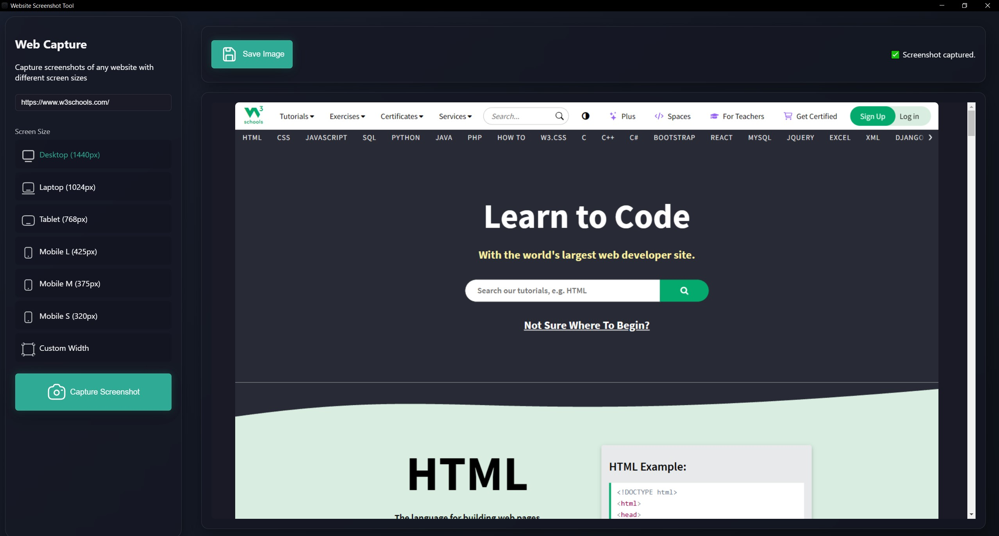

# Web Screenshot Tool

A **cross-platform** desktop application built with **Electron** that allows you to capture screenshots of any website at different screen sizes — **quickly and easily**.

<!-- Optional banner -->



---

## ✨ Features

- 📸 Capture **full-page** screenshots of any website
- 🖥️ Multiple preset screen sizes:
  - Desktop (1440px)
  - Laptop (1024px)
  - Tablet (768px)
  - Mobile Large (425px)
  - Mobile Medium (375px)
  - Mobile Small (320px)
- ✏️ **Custom width** option
- 🖥️ Cross-platform (Windows available)

---

## 📥 Download Windows

[](https://github.com/MatrixRex/Web-ScreenShot/releases/download/v1.0.0/Web.Screenshot-Portable.exe)

> 👉 The portable version runs without installation. Just download and run!

---

## 🛠 Installation (Development)

1. **Clone the repository:**

```bash
git clone https://github.com/yourusername/Web-ScreenShot.git
cd Web-ScreenShot
```

2. **Install dependencies:**

```bash
npm install
```

3. **Start the application:**

```bash
npm start
```

---

## ⚙️ Building (for production)

To build the app for your platform:

```bash
npm run build
```

After building, you will find your executables inside the `/dist` folder.

---

## 🧪 Development Commands

| Command         | Purpose                               |
| :-------------- | :------------------------------------ |
| `npm start`     | Start the app in **development mode** |
| `npm run build` | **Build** the app for production      |
| `npm run pack`  | Create an **unpacked** app version    |

---

## 🧩 Technologies Used

- [Electron](https://www.electronjs.org/)
- [Puppeteer](https://pptr.dev/)
- HTML5
- CSS3
- JavaScript (ES6)

---

## 📜 License

This project is licensed under the **MIT License**.  
See the [LICENSE](LICENSE) file for more details.

---
